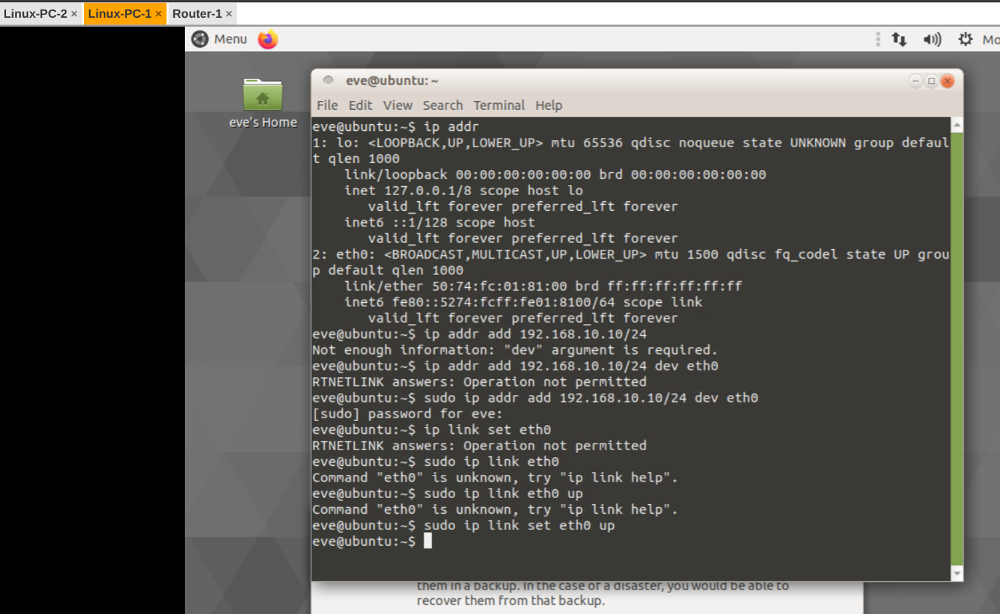
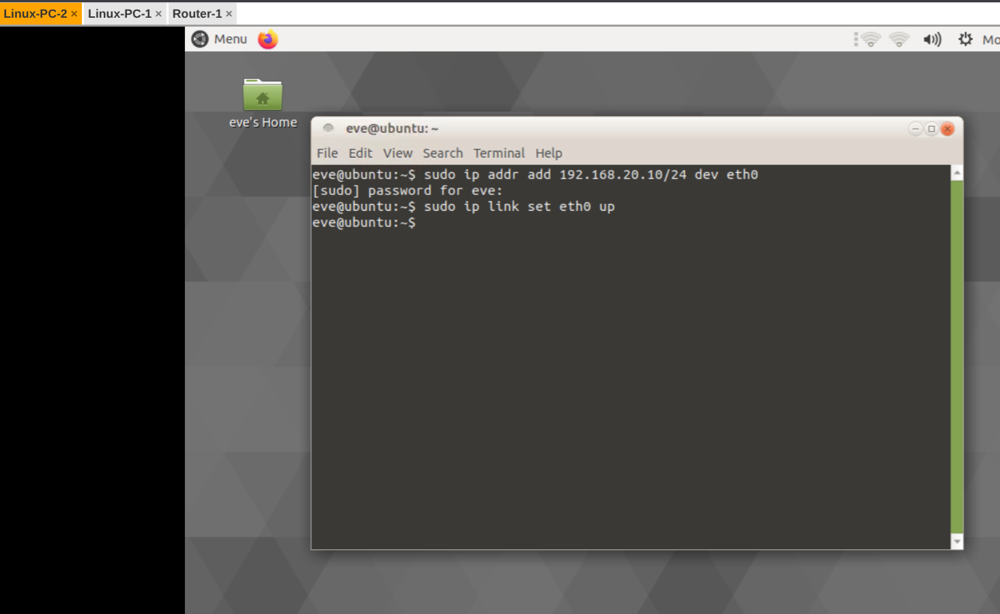
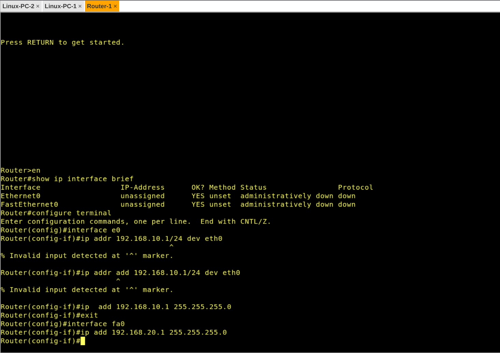
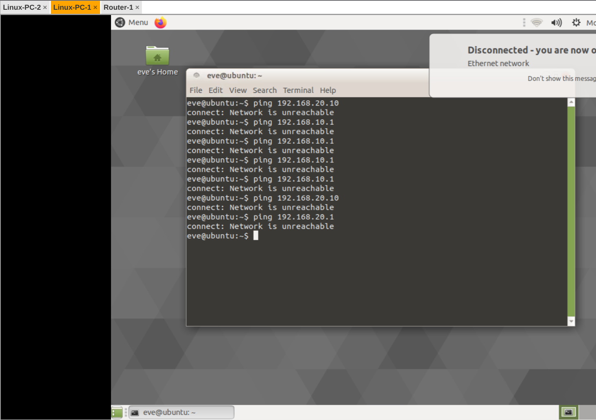
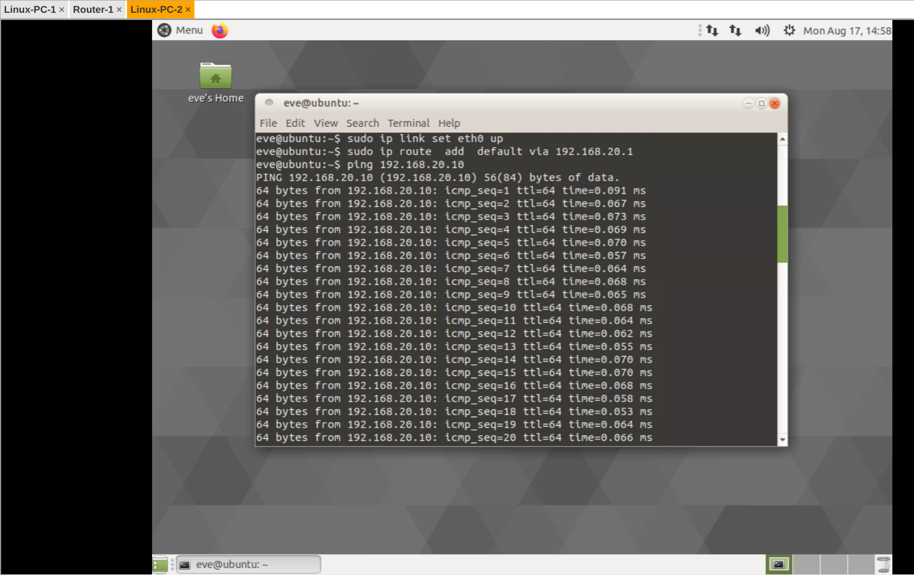
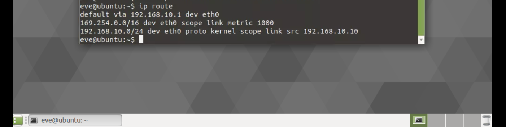
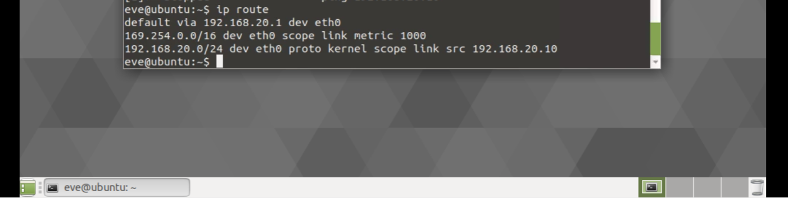

# Laboratório 01 — Configuração inicial no PNetLab

> Disciplina: ENE0025 - Protocolos de Transporte e Roteamento (UnB) · Prof. Dr. Laerte Peotta de Melo
> Roteiro de referência: [peotta/PTR](https://github.com/peotta/PTR)
> [⬅ Voltar ao README](../README.md)

---

**Universidade de Brasília**

Engenharia de Redes de Comunicação

**Relatório – Laboratório 01**

Configuração inicial no PNetLab

**Aluno:** Lucas de souza viegas

**Matrícula:** 221021278

**Disciplina**: Protocolos de Transporte e Roteamento

**Professor**: Prof. Dr. Laerte Peotta de Melo

# 1. Objetivos do laboratório

- Compreender que redes distintas não se comunicam automaticamente.

- Identificar o papel do roteador como elemento lógico de interconexão.

- Diferenciar falha de comunicação por ausência de roteamento de falha física.

- Relacionar teoria de roteamento com comportamento real da rede.

# 2. Cenário do laboratório

Topologia lógica utilizada: dois hosts Linux (Host A e Host B) conectados a um roteador Cisco 1710 (Router-1), cada host em um segmento Ethernet distinto (/24), interligados pelo roteador.

**Recursos utilizados no PNetLab**

- 1 roteador Cisco 1710 (Cisco IOS)

- 2 hosts Linux

- Linux-PC-1 → Host A

- Linux-PC-2 → Host B

- 2 segmentos Ethernet

# 3. Parte 1 – Montagem da topologia

**Passo 1 – Criação do laboratório**

Laboratório criado no PNetLab com o nome Aula1_Conceitos_Roteamento, contendo os nós Linux-PC-1 (Host A), Linux-PC-2 (Host B) e Router-1 (Cisco 1710).

**Passo 2 – Conexão dos dispositivos**

- Host A (Linux-PC-1) → Interface Ethernet0/0 do Router-1

- Host B (Linux-PC-2) → Interface FastEthernet0 do Router-1

# 4. Parte 2 – Configuração de endereçamento IP

**Endereçamento utilizado**

| **Dispositivo**     | **Interface** | **IP**        | **Máscara** | **Dispositivo**     | **Interface** |
|---------------------|---------------|---------------|-------------|---------------------|---------------|
| Host A              | eth0          | 192.168.10.10 | /24         | Host A              | eth0          |
| Router (Cisco 1710) | Ethernet0/0   | 192.168.10.1  | /24         | Router (Cisco 1710) | Ethernet0/0   |
| Router (Cisco 1710) | Fa0           | 192.168.20.1  | /24         | Router (Cisco 1710) | Fa0           |

**Passo 3 – Configuração dos hosts**

Host A:

sudo ip addr add 192.168.10.10/24 dev eth0sudo ip link set eth0 up

Host B:

sudo ip addr add 192.168.20.10/24 dev eth0sudo ip link set eth0 up

Nota metodológica: nos hosts Linux do PNetLab, o usuário padrão (eve) não possui permissão para alterar interfaces de rede diretamente — os comandos ip addr/ip link precisaram ser executados com sudo. Sem essa permissão, o comando falha silenciosamente e o IP não é atribuído, o que foi identificado ao inspecionar a saída de ip addr show eth0.

*Figura 1 – Configuração de IP no Host A (sudo ip addr add / ip link set up)*

*Figura 2 – Configuração de IP no Host B (sudo ip addr add / ip link set up)*

**Passo 4 – Configuração do roteador (Cisco IOS)**

A configuração do roteador foi feita da seguinte forma

“enable”

logo há o início da configuração do primeiro host que se inicia com “ configure terminal” e dentro dele há os comandos “ address 192.168.10.1 255.255.255.0” e “no shutdown” para que não seja desligado e “exit” para sair.

A configuração do segundo host é feita de forma semelhante mas mudando o ip para “ip address 192.168.20.1 255.255.255.0”

No Cisco, a sintaxe de atribuição de endereço é diferente do Linux: usa-se ip address \<ip\> \<máscara\> dentro do modo de configuração de interface (interface \<nome\>), seguido de no shutdown para ativar a interface — equivalente ao ip link set up do Linux.

*Figura 3 – Configuração das interfaces do Router-1 via CLI Cisco IOS*

# 5. Parte 3 – Testes de conectividade sem roteamento

**Passo 5 – Testes iniciais**

Do Host A:

ping 192.168.20.10 → Resultado: falha (Network is unreachable)ping 192.168.10.1 → Resultado esperado: sucesso

*Figura 4 – Testes de ping do Host A antes da configuração de rota default*

**Discussão orientada**

1- O enlace físico funciona?

Sim. A conectividade de camada 2 estava operacional —pois ao inserir os Ips de forma correta, o Host A conseguiu alcançar o roteador (192.168.10.1), que está no mesmo segmento físico.

2- O IP está configurado corretamente?

Sim, após a correção com sudo, cada host recebeu o IP correto em sua respectiva sub-rede (192.168.10.10/24 no Host A e 192.168.20.10/24 no Host B), confirmado pela saída de ip addr show eth0.

3- Por que o pacote não chega ao Host B?

Porque a rede de destino (192.168.20.0/24) não está diretamente conectada ao Host A, e o Host A não possuía nenhuma rota (nem específica, nem default) informando por onde encaminhar pacotes destinados a essa rede. Sem uma entrada na tabela de rotas, o kernel do Linux não sabe qual interface/gateway usar e retorna "Network is unreachable".

Conclusão: Sem uma decisão de encaminhamento, o pacote não sabe para onde ir.

# 6. Parte 4 – Introdução da decisão de roteamento

**Passo 6 – Configuração do gateway padrão**

Host A:

sudo ip route add default via 192.168.10.1

Host B:

sudo ip route add default via 192.168.20.1

**Passo 7 – Novo teste de conectividade**

ping 192.168.20.10 → Resultado: sucesso

*Figura 5 – Ping bem-sucedido entre os hosts após configuração da rota default*

Com a rota default apontando para o roteador, o Host A passou a encaminhar para 192.168.10.1 qualquer pacote destinado a uma rede que não conhece diretamente. O roteador, por sua vez, está diretamente conectado às duas redes (192.168.10.0/24 e 192.168.20.0/24) e consegue entregar o pacote ao Host B.

# 7. Parte 5 – Observação da tabela de rotas

**Passo 8 – Exame das tabelas de rotas**

Host A (comando ip route):

*Figura 6 – Tabela de rotas do Host A*

Host B (comando ip route):

*Figura 7 – Tabela de rotas do Host B*

**Pontos observados**

- Rota diretamente conectada: cada host possui uma entrada para sua própria sub-rede /24 (ex.: 192.168.10.0/24 dev eth0 proto kernel scope link), gerada automaticamente ao configurar o IP na interface.

- Rota default: aparece como default via \<gateway\> dev eth0, e é usada para qualquer destino que não corresponda a nenhuma rota mais específica na tabela.

- Decisão local em cada salto: cada dispositivo (Host A, roteador, Host B) consulta apenas sua própria tabela de rotas para decidir o próximo salto — não existe visão global do caminho armazenada em nenhum ponto único.

# 8. Parte 6 – Amarração com a teoria

**Discussão final orientada**

1- O roteador conhece o caminho completo?

Não. O roteador conhece apenas as redes às quais será feita a conexão, que no caso são 192.168.10.0/24 e 192.168.20.0/24 em seus respectivos hosts. Nesse cenário de um único roteador, isso é suficiente para interligar as duas redes, mas o roteador não possui nenhum conhecimento sobre a topologia como um todo.

2- Onde ocorreu a "inteligência" da rede?

Na decisão de encaminhamento tomada individualmente por cada dispositivo, com base em sua tabela de rotas local. Não há um controlador central: cada salto (Host A → Router → Host B) decide por conta própria, consultando apenas suas próprias entradas de rota.

3- O que aconteceria com mais roteadores?

Cada roteador adicional só conheceria, por padrão, as redes diretamente conectadas a ele. Para que pacotes atravessem múltiplos roteadores até redes remotas, seria necessário configurar rotas estáticas adicionais em cada salto, ou implantar um protocolo de roteamento dinâmico (por exemplo, RIP, OSPF ou BGP) para que os roteadores troquem informações de topologia entre si e construam suas tabelas automaticamente.

**Relação com os conceitos teóricos**

Encaminhamento (forwarding) × Roteamento (routing): forwarding é a ação mecânica e imediata de enviar um pacote pela interface de saída correta, com base em uma consulta à tabela de rotas já existente , foi o que ocorreu a cada ping bem-sucedido. Routing é o processo, estático ou dinâmico, de construir e manter essa tabela de rotas. Neste laboratório, o roteamento foi feito de forma estática e manual usando os comandos ip route add / ip address no roteador, sem uso de protocolo de roteamento dinâmico.

Plano de dados × Plano de controle: o plano de dados corresponde ao tráfego real de pacotes trafegando pela rede, os pacotes ICMP do ping. O plano de controle corresponde à lógica e às configurações que determinam como esses pacotes serão encaminhados neste caso, as configurações manuais de IP, interface e rota default aplicadas em cada dispositivo.

# 9. Considerações finais

Assim podemos concluir que a comunicação entre redes distintas não é feita de forma automática. dessa forma vai depender da configuração do endereçamento ip, e caso haja a existência de uma rota estática, informando o próximo salto para redes que não estão conectadas. A ausência de uma decisão de encaminhamento seja por falta de rota, falha na atribuição do próprio IP e das permissões insuficientes, resulta em falha de comunicação mesmo quando a camada física está íntegra, reforçando a separação entre problemas de enlace físico e problemas de camada de rede.
