# Laboratório 02 — Configuração básica de roteadores no PNetLab

> Disciplina: ENE0025 - Protocolos de Transporte e Roteamento (UnB) · Prof. Dr. Laerte Peotta de Melo
> Roteiro de referência: [peotta/PTR](https://github.com/peotta/PTR)
> [⬅ Voltar ao README](../README.md)

---

**Universidade de Brasília**

Engenharia de Redes de Comunicação

**Relatório – Laboratório 02**

Configuração básica de roteadores no PNetLab

**Aluno:** Lucas de Souza Viegas

**Matrícula:** 221021278

**Disciplina:** Protocolos de Transporte e Roteamento

**Professor:** Dr. Laerte Peotta de Melo

# **1. Introdução e Objetivos**

Este laboratório teve como objetivo introduzir a configuração inicial de roteadores Cisco em ambiente emulado no PNetLab, cobrindo o acesso ao CLI via console, a definição de parâmetros básicos de administração, a configuração de endereçamento IP na interface LAN, a habilitação de acesso remoto seguro via SSH e a realização de testes de conectividade entre os hosts da rede.

# **2. Topologia**

A topologia implementada no PNetLab é composta por 1 roteador (R1), 1 switch (SW1), 2 hosts Linux (PC1 e PC2) e 1 Terminal, todos interligados através do switch. O roteador conecta-se ao SW1 pela interface Ethernet0/1 (rede 192.168.0.0/24, onde estão PC1 e PC2) e, adicionalmente, foi configurada a interface Ethernet0/0 (rede 192.168.1.0/24) para o link dedicado ao Terminal, permitindo testes de acesso remoto (SSH) através de uma sub-rede distinta.

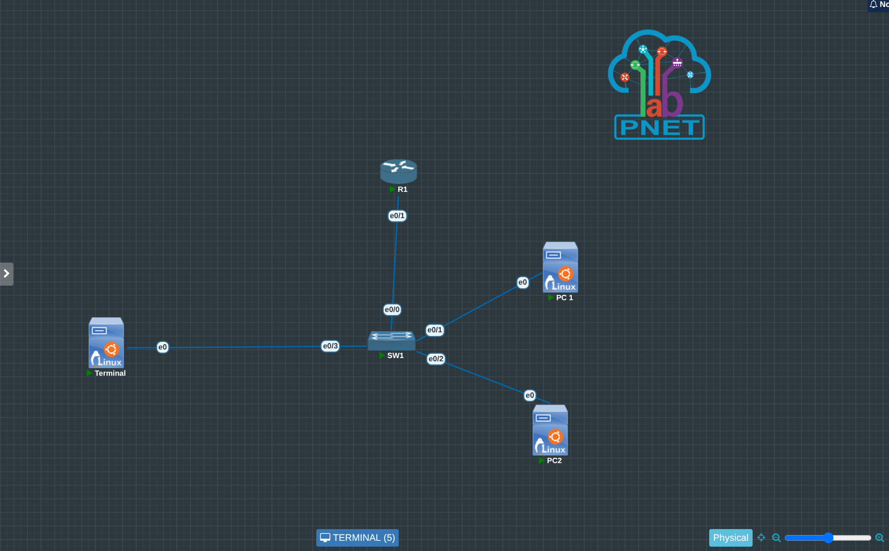

*Figura 1 – Topologia final montada no PNetLab*

## **2.1 Endereçamento IP**

| **Dispositivo** | **Interface** | **Endereço IP** | **Máscara**   | **Gateway Padrão** | **Observação**                     |
|-----------------|---------------|-----------------|---------------|--------------------|------------------------------------|
| Router R1       | Ethernet0/1   | 192.168.0.254   | 255.255.255.0 | —                  | Interface LAN do roteador          |
| Router R1       | Ethernet0/0   | 192.168.1.254   | 255.255.255.0 | —                  | Link dedicado ao Terminal          |
| PC 1            | eth0          | 192.168.0.1     | 255.255.255.0 | 192.168.0.254      | Host conectado ao switch           |
| PC 2            | eth0          | 192.168.0.2     | 255.255.255.0 | 192.168.0.254      | Host conectado ao switch           |
| Terminal        | eth0          | —               | —             | —                  | Acesso local via switch (SW1 e0/3) |

# **3. Configuração do Roteador**

## **3.1 Configuração inicial**

Definição de hostname, desabilitação de resolução de DNS, banner de acesso restrito e senha de modo privilegiado criptografada:

enable  
configure terminal  
hostname R1  
no ip domain-lookup  
banner motd \#  
Acesso restrito. Somente usuarios autorizados.  
\#  
enable secret unb123  
service password-encryption

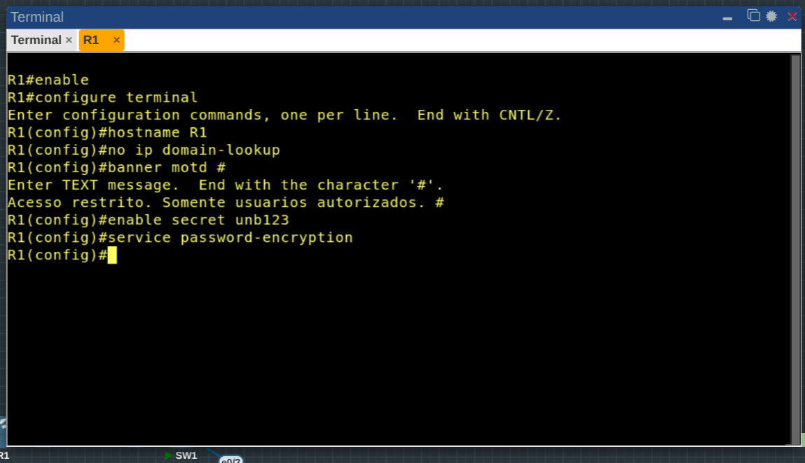

*Figura 2 – Configuração inicial do roteador R1*

## **3.2 Configuração da linha de console**

line console 0  
password cisco  
login  
logging synchronous  
exec-timeout 10 0  
exit

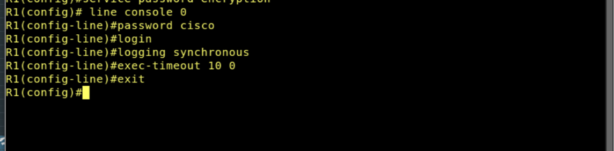

*Figura 3 – Configuração da linha de console*

## **3.3 Criação de usuário local e habilitação de SSH**

username admin privilege 15 secret Admin@123  
ip domain-name unb.lab  
crypto key generate rsa  
1024  
ip ssh version 2  
line vty 0 4  
login local  
transport input ssh  
exec-timeout 10 0  
logging synchronous  
exit

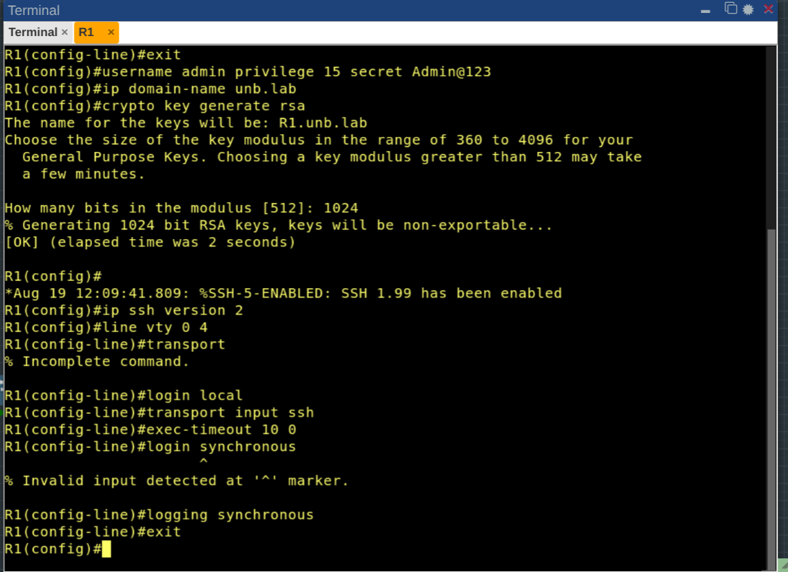

*Figura 4 – Geração da chave RSA e habilitação do SSH (%SSH-5-ENABLED)*

## **3.4 Configuração da interface LAN**

A interface conectada ao switch da LAN é a Ethernet0/1, recebendo o endereço de gateway da rede 192.168.0.0/24:

interface e0/1  
description LAN-PNETLAB  
ip address 192.168.0.254 255.255.255.0  
no shutdown  
exit  
end  
copy running-config startup-config

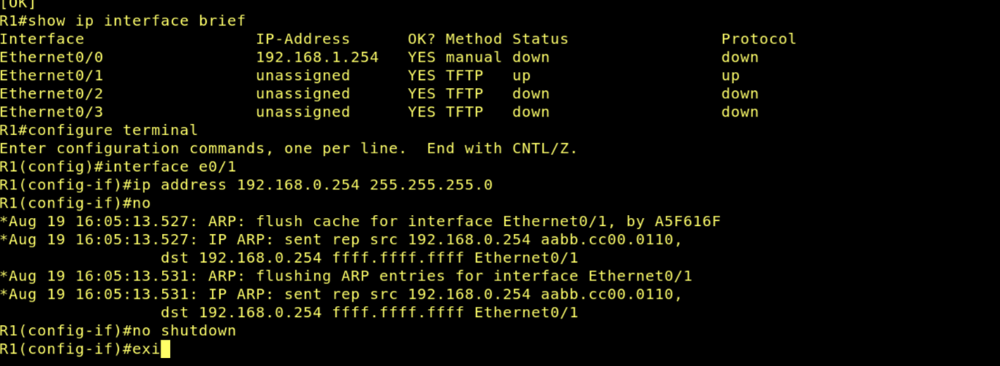

*Figura 5 – Interface Ethernet0/1 configurada e ativa (up/up)*

## **3.5 Configuração completa do roteador (show running-config)**

A saída completa do comando show running-config, executado ao final da atividade, confirma que todos os parâmetros configurados foram aplicados e persistidos corretamente:

R1#show running-config  
Building configuration...  
  
Current configuration : 1417 bytes  
!  
version 15.4  
service timestamps debug datetime msec  
service timestamps log datetime msec  
service password-encryption  
!  
hostname R1  
!  
boot-start-marker  
boot-end-marker  
!  
enable secret 5 \$1\$JP/c\$VIv3k71u6FyKqRUq6fbri1  
!  
no aaa new-model  
clock timezone -03 -3 0  
mmi polling-interval 60  
no mmi auto-configure  
no mmi pvc  
mmi snmp-timeout 180  
no ip icmp rate-limit unreachable  
!  
no ip domain lookup  
ip domain name unb.lab  
ip cef  
no ipv6 cef  
!  
multilink bundle-name authenticated  
!  
username admin privilege 15 secret 5 \$1\$Fl.6\$OrmqRMLrWIrbsENLJbfod0  
!  
redundancy  
!  
no cdp log mismatch duplex  
!  
ip tcp synwait-time 5  
ip ssh version 2  
!  
interface Ethernet0/0  
description LINK-TERMINAL  
ip address 192.168.1.254 255.255.255.0  
!  
interface Ethernet0/1  
description LAN-PNETLAB  
ip address 192.168.0.254 255.255.255.0  
!  
interface Ethernet0/2  
no ip address  
!  
interface Ethernet0/3  
no ip address  
!  
ip forward-protocol nd  
!  
no ip http server  
no ip http secure-server  
!  
control-plane  
!  
banner motd ^C  
Acesso restrito. Somente usuarios autorizados. ^C  
!  
line con 0  
privilege level 15  
password 7 094F471A1A0A  
logging synchronous  
login  
line aux 0  
exec-timeout 0 0  
privilege level 15  
logging synchronous  
line vty 0 4  
logging synchronous  
login local  
transport input ssh  
!  
end

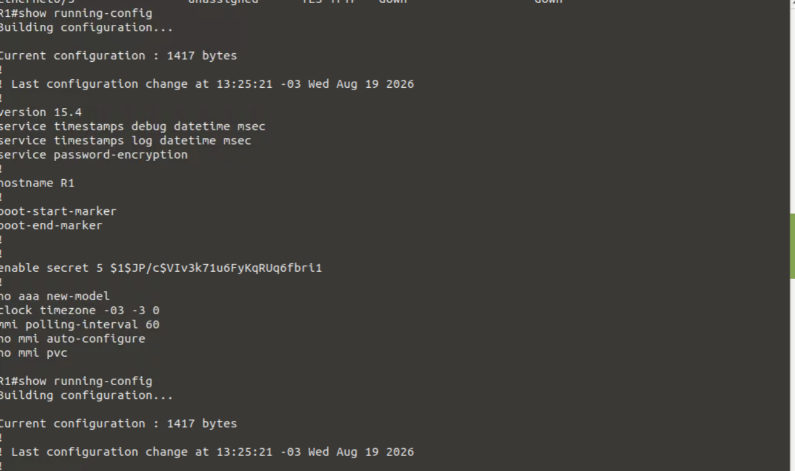

*Figura 9.1 – show running-config (cabeçalho e parâmetros globais)*

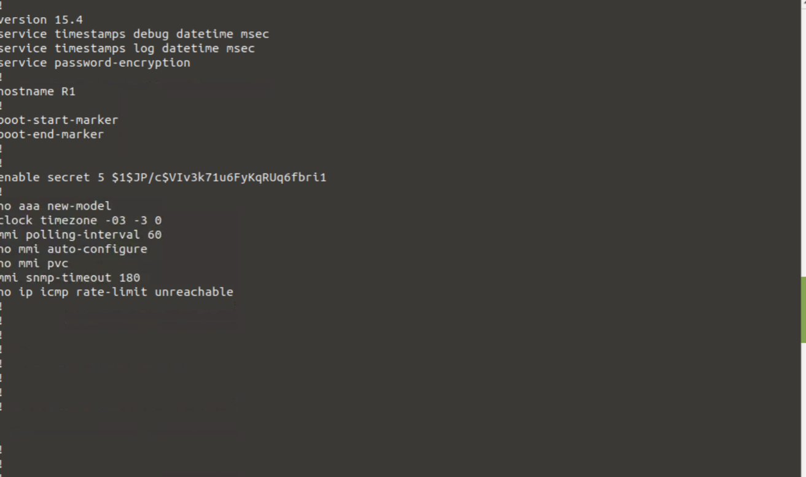

*Figura 9.2 – show running-config (parâmetros de sistema)*

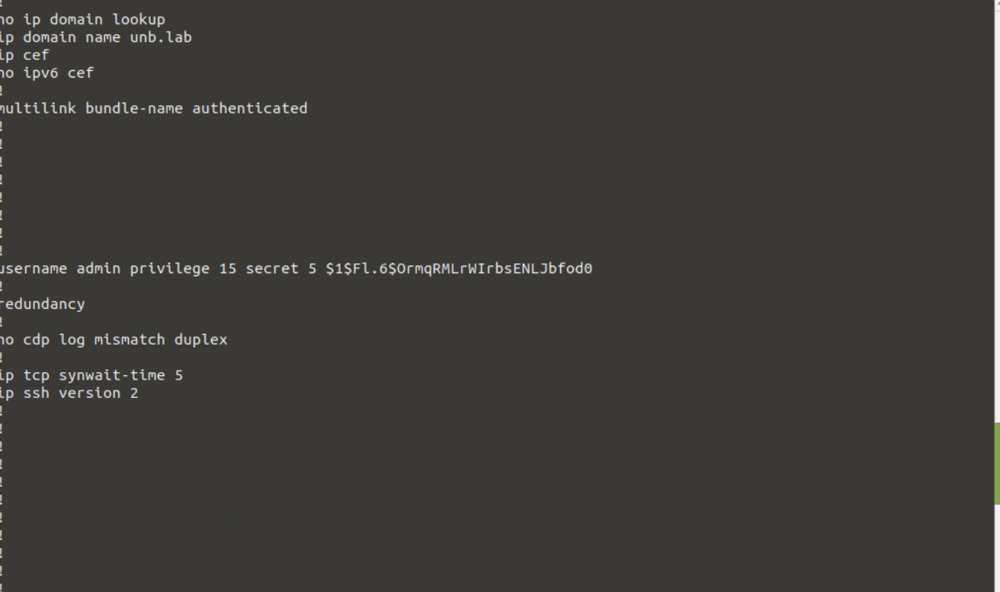

*Figura 9.3 – show running-config (domínio, usuário local e SSH)*

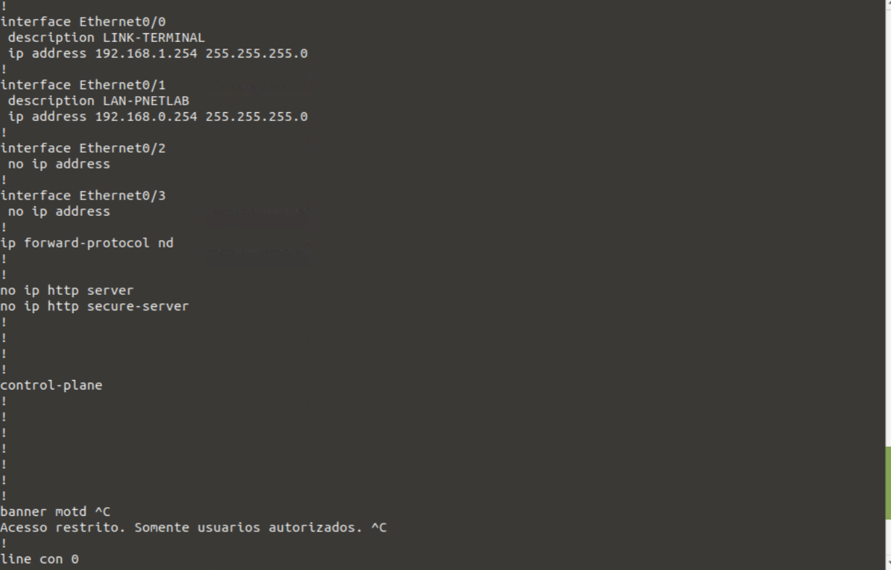

*Figura 9.4 – show running-config (interfaces Ethernet0/0 a Ethernet0/3)*

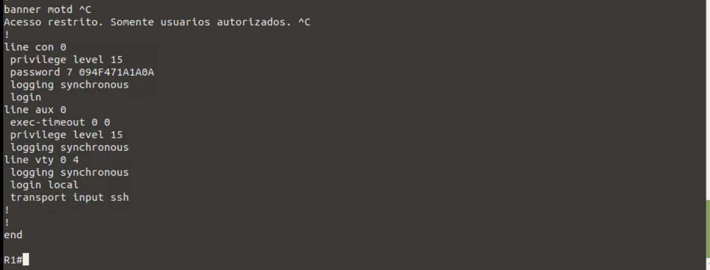

*Figura 9.5 – show running-config (banner e linhas con/aux/vty)*

# **4. Configuração dos Hosts**

PC1 e PC2 são máquinas virtuais Linux (Ubuntu). O endereçamento IP foi realizado via linha de comando:

**PC1:**

sudo ip addr add 192.168.0.1/24 dev eth0  
sudo ip link set eth0 up  
sudo ip route add default via 192.168.0.254

**PC2:**

sudo ip addr add 192.168.0.2/24 dev eth0  
sudo ip link set eth0 up  
sudo ip route add default via 192.168.0.254

# **5. Testes de Verificação**

## **5.1 Verificação das interfaces (show ip interface brief)**

show ip interface brief

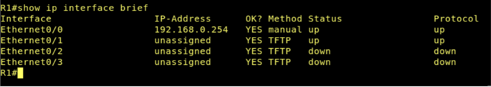

*Figura 10 – Saída do comando show ip interface brief no R1*

## **5.2 Conectividade PC1 → gateway e PC1 → PC2**

ping -c 4 192.168.0.254  
ping -c 4 192.168.0.2

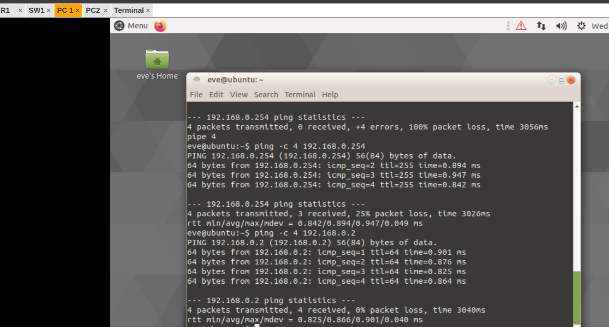

*Figura 11 – Testes de ping a partir do PC1 (0% de perda)*

## **5.3 Conectividade PC2 → gateway e PC2 → PC1**

ping -c 4 192.168.0.254  
ping -c 4 192.168.0.1

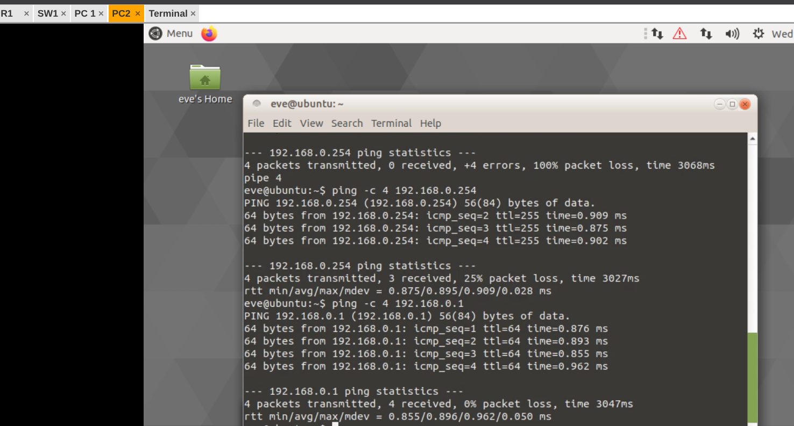

*Figura 12 – Testes de ping a partir do PC2 (0% de perda)*

## **5.4 Acesso remoto via SSH**

Conexão SSH estabelecida a partir do PC1 até o roteador R1, autenticada com o usuário local criado (admin), exibindo o banner de acesso restrito e o prompt privilegiado do roteador:

ssh admin@192.168.0.254

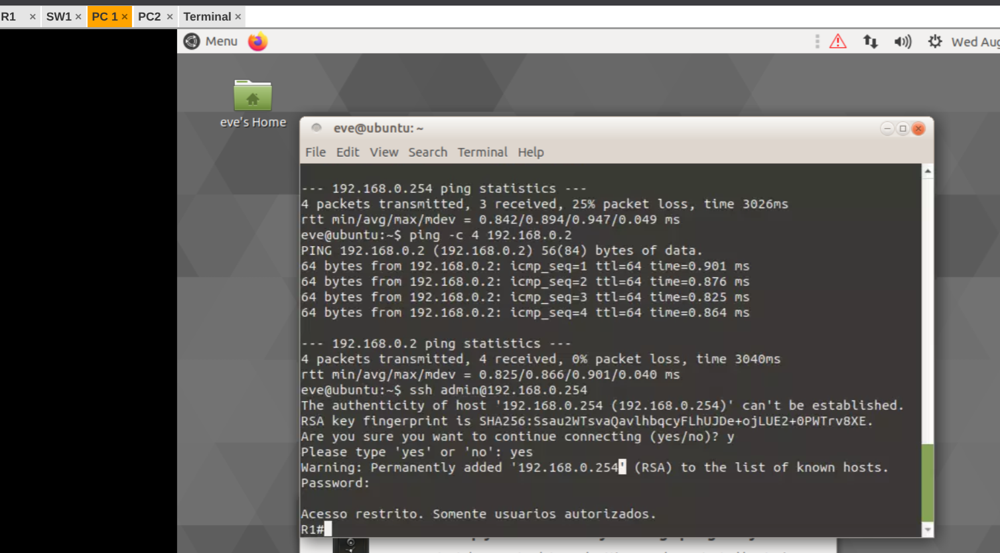

*Figura 13 – Sessão SSH autenticada com sucesso no R1*

# **6. Questões para Reflexão**

**1) Qual a diferença entre acesso via console e acesso remoto pela rede?**

O acesso ocorre via cabo conectado à porta dedicada do console no equipamento, funcionando mesmo sem qualquer configuração de rede prévia é o único meio de acesso quando o roteador ainda não possui IP configurado. Já o acesso remoto pela rede que pode ser tanto por Telnet ou SSH vai depender de conectividade IP já estabelecida assim permitindo administração a partir de qualquer ponto da rede.

**2) Qual a função do comando no ip domain-lookup em laboratório?**

Esse comando desabilita a tentativa automática do roteador de resolver, via DNS, qualquer palavra digitada de forma incorreta no CLI. Sem ele, um comando digitado errado gera uma tentativa de consulta DNS que trava o terminal por um bom tempo até expirar que no caso seria timeout, o que é especialmente incômodo em ambientes de laboratório sem servidor DNS disponível.

**3) Por que o comando enable secret é preferível ao enable password?**

O enable secret armazena a senha utilizando hash criptográfico, tornando sua reversão praticamente inviável mesmo com acesso ao arquivo de configuração. Já o enable password, quando não combinado com service password-encryption, é gravado em texto claro; mesmo com a criptografia de serviço ativada, utiliza um algoritmo fraco (Vigenère/tipo 7), facilmente reversível.

**4) Por que o protocolo SSH é mais seguro que o Telnet?**

O SSH vai criptografar todo o tráfego da sessão sendo eles: autenticação, comandos e respostas, dessa forma impedindo que credenciais e informações sensíveis sejam capturadas por sniffing na rede. O Telnet trafega tudo em texto claro, expondo usuário, senha e comandos digitados a qualquer atacante com acesso ao mesmo segmento de rede.

**5) O que ocorre se a interface não receber o comando no shutdown?**

A interface permanece desligada, mesmo que o cabo físico esteja corretamente conectado. Nesse estado, a interface não envia nem recebe tráfego, o que impede qualquer comunicação através dela até que o comando no shutdown seja aplicado.

# **7. Conclusão**

O laboratório permitiu consolidar as competências de configuração básica de roteadores em um ambiente emulado: acesso via console, definição de parâmetros de administração, endereçamento IP da interface LAN, habilitação de acesso remoto seguro via SSH e validação da conectividade entre roteador e hosts. Essas habilidades formam a base necessária para os próximos laboratórios da disciplina, voltados a protocolos de roteamento estático e dinâmico.
