# Laboratório 03 — Multicast IP com PIM-DM em topologia controlada

> Disciplina: ENE0025 - Protocolos de Transporte e Roteamento (UnB) · Prof. Dr. Laerte Peotta de Melo
> Roteiro de referência: [peotta/PTR](https://github.com/peotta/PTR)
> [⬅ Voltar ao README](../README.md)

---

**Relatório: Laboratório 03 (PTR)**

*Multicast IP com PIM-DM em topologia controlada*

Repositório de referência: github.com/peotta/PTR/labs/lab03.md

## 1. Objetivo

Implementar uma topologia controlada no PNetLab para explorar o roteamento multicast IP utilizando o protocolo PIM em modo Dense (PIM-DM), verificando o encaminhamento (flood) do tráfego a partir de um host de origem até um host receptor associado ao grupo multicast 239.1.1.1.

## 2. Montagem da Topologia

A topologia foi montada no PNetLab com um roteador Cisco (imagem IOL L3-ADVENTERPRISEK9-M-15.4-2T), dois switches L2 e dois hosts Linux, conforme abaixo:

- R1: Ethernet0/0 em 192.168.10.1/24 (rede do Host Origem) e Ethernet0/1 em 192.168.20.1/24 (rede do Host Receptor)

- SW2 interliga o Host Origem (192.168.10.10) ao R1 (e0/0)

- SW1 interliga o Host Receptor (192.168.20.10) ao R1 (e0/1)

- Grupo multicast de teste: 239.1.1.1

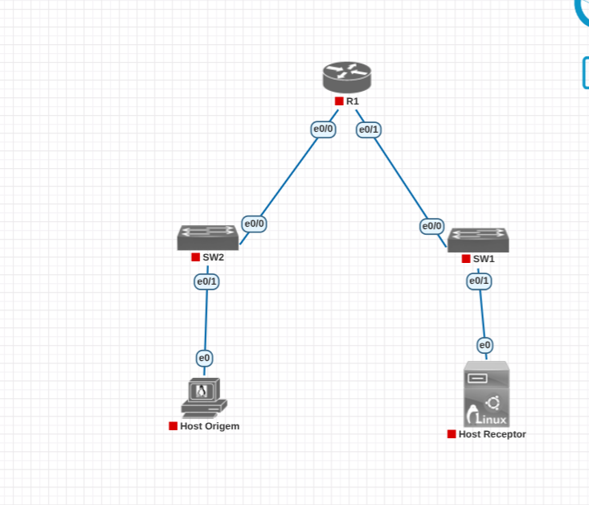

*Figura 1: Topologia inicial montada no PNetLab.*

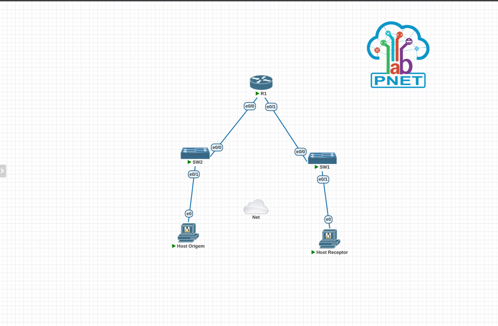

*Figura 2: Topologia final, incluindo a rede Cloud0 usada temporariamente para dar acesso à internet aos hosts.*

## 3. Configuração Básica das Interfaces do R1

Após iniciar os nós, as interfaces do roteador foram configuradas com os endereços IP das duas sub-redes e verificadas com o comando show ip interface brief, confirmando o estado up/up em ambas:

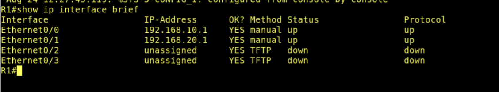

*Figura 3: Interfaces Ethernet0/0 e Ethernet0/1 do R1 ativas (up/up).*

## 4. Habilitação de Multicast e PIM Dense Mode

Em seguida, o roteamento multicast foi habilitado globalmente (ip multicast-routing) e o PIM-DM foi ativado em ambas as interfaces do R1 (ip pim dense-mode). A verificação com show ip pim interface confirmou o funcionamento, com o R1 atuando como Designated Router (DR) nas duas redes:

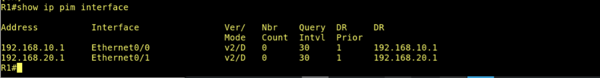

*Figura 4: PIM versão 2, modo Dense (v2/D) ativo nas interfaces do R1.*

## 5. Acesso Temporário à Internet via Cloud0

Como as imagens dos hosts Linux não possuíam o utilitário iperf pré-instalado e não havia acesso à internet pela topologia original, foi adotada a orientação passada em sala: desconectar temporariamente cada host do switch do laboratório, conectá-lo à rede Cloud0 do PNetLab (que faz bridge com a rede do servidor), obter IP via DHCP, instalar o pacote necessário e, então, reconectar o host à topologia original com a configuração de IP fixo restabelecida.

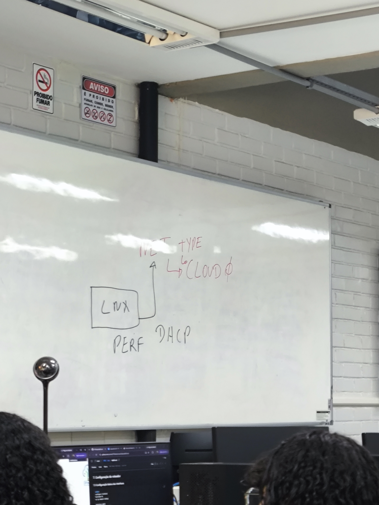

*Figura 5: Esquema no quadro (aula) ilustrando a conexão temporária de um host Linux ao Cloud0 para obter IP via DHCP.*

### 5.1 Instalação do iperf

Com o host conectado ao Cloud0 e IP obtido via DHCP, foi possível instalar o pacote iperf (versão 2.0.10) em ambos os hosts:

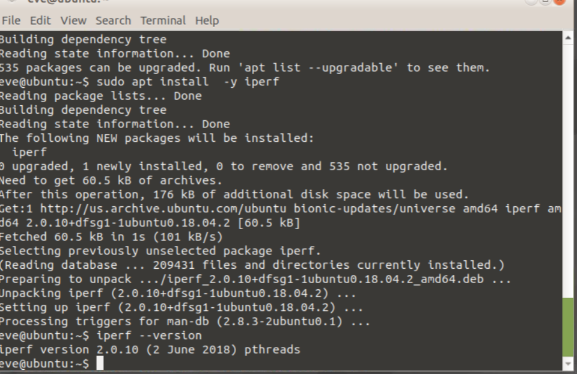

*Figura 6: Instalação do iperf concluída com sucesso no Host Origem (mesmo procedimento repetido no Host Receptor).*

### 5.2 Restabelecimento da configuração de IP fixo

Após a instalação, cada host foi desconectado do Cloud0, reconectado ao switch original da topologia, e reconfigurado com o IP fixo e a rota padrão correspondentes ao seu segmento de rede:

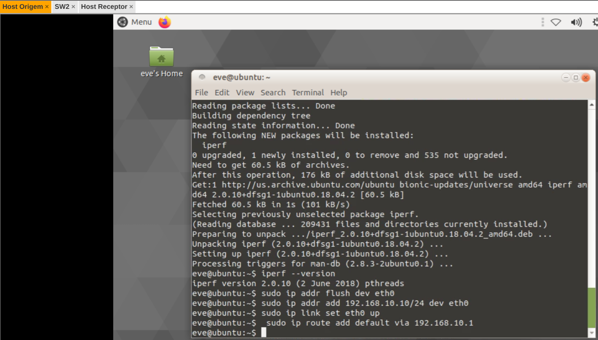

*Figura 7: Host Origem com IP 192.168.10.10/24 e rota padrão via 192.168.10.1 restabelecidos.*

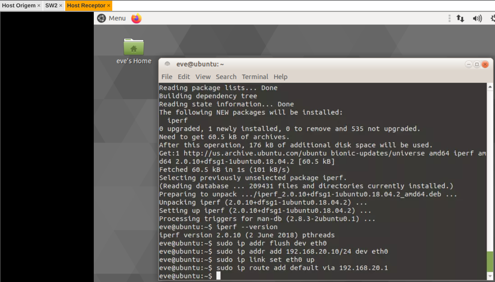

*Figura 8: Host Receptor com IP 192.168.20.10/24 e rota padrão via 192.168.20.1 restabelecidos.*

## 6. Verificação de Conectividade e Primeiro Teste de Tráfego Multicast

Com a topologia restabelecida, a conectividade unicast entre cada host e seu respectivo gateway (R1) foi validada com sucesso via ping. Em seguida, começou o teste de tráfego multicast: o Host Receptor foi colocado em modo servidor do iperf e associado (bind) ao grupo multicast 239.1.1.1, o que dispara o IGMP Join do host, enquanto o Host Origem enviava tráfego UDP para o mesmo grupo.

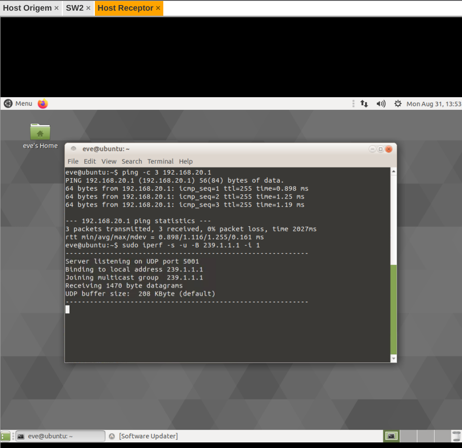

*Figura 9: Host Receptor, ping ao gateway bem-sucedido e servidor iperf associado ao grupo multicast 239.1.1.1.*

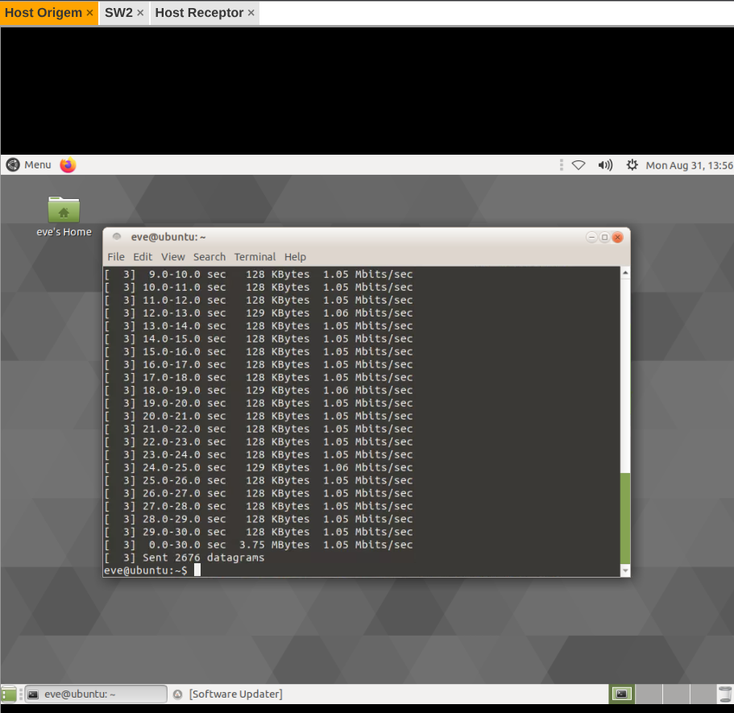

*Figura 10: Host Origem enviando tráfego UDP multicast (2676 datagramas transmitidos em 30 segundos).*

## 7. Status Atual e Próximos Passos

As etapas de montagem da topologia, configuração unicast, ativação do PIM-DM no roteador e preparação dos hosts (incluindo a instalação do iperf via Cloud0) foram concluídas com sucesso. Já a verificação fim a fim do encaminhamento multicast, ou seja, confirmar que o tráfego enviado pelo Host Origem realmente chega ao Host Receptor passando pelo R1, ainda está em andamento e será documentada em uma atualização deste relatório assim que a investigação for concluída (verificação de show ip mroute, RPF, IGMP snooping nos switches e depuração do encaminhamento no roteador).

Durante a investigação, percebeu-se que os endereços IP fixos configurados manualmente (via ip addr add) nos hosts Linux não persistem entre reinicializações dos nós: a interface eth0 volta para um endereço link-local (169.254.0.0/16) quando o host é reiniciado, já que essa imagem usa Netplan em vez do ifupdown clássico. Esse comportamento foi identificado como a causa mais provável da ausência de tráfego de dados observada, e o próximo passo é tornar a configuração de IP persistente via /etc/netplan/ em ambos os hosts. A verificação mais recente de show ip mroute e show ip pim interface no R1, feita durante um novo teste de envio, ainda mostra apenas a entrada (\*, 239.1.1.1), sem uma entrada (S, G) específica, o que reforça que o tráfego de dados não está sendo gerado com o endereço de origem correto no momento da captura:

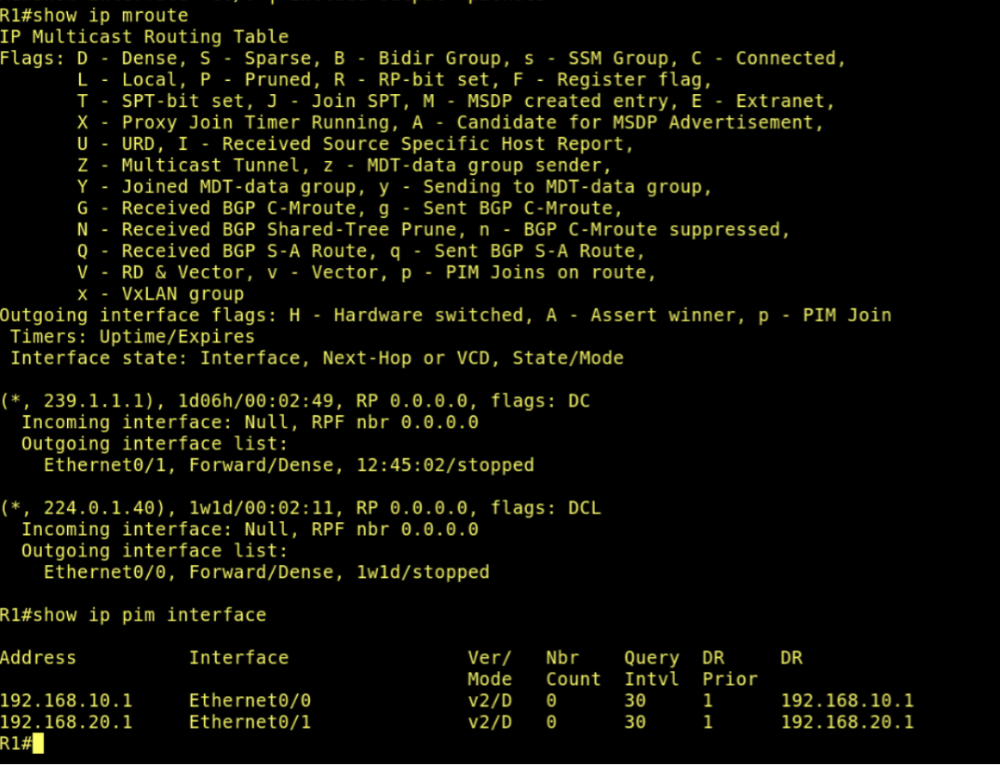

*Figura 11: show ip mroute e show ip pim interface no R1 durante um novo teste, apenas a entrada (\*, 239.1.1.1) está presente, sem entrada (S, G) da fonte 192.168.10.10.*

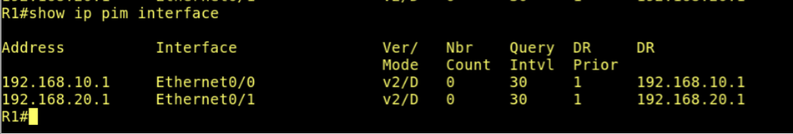

*Figura 12: show ip pim interface no R1.*

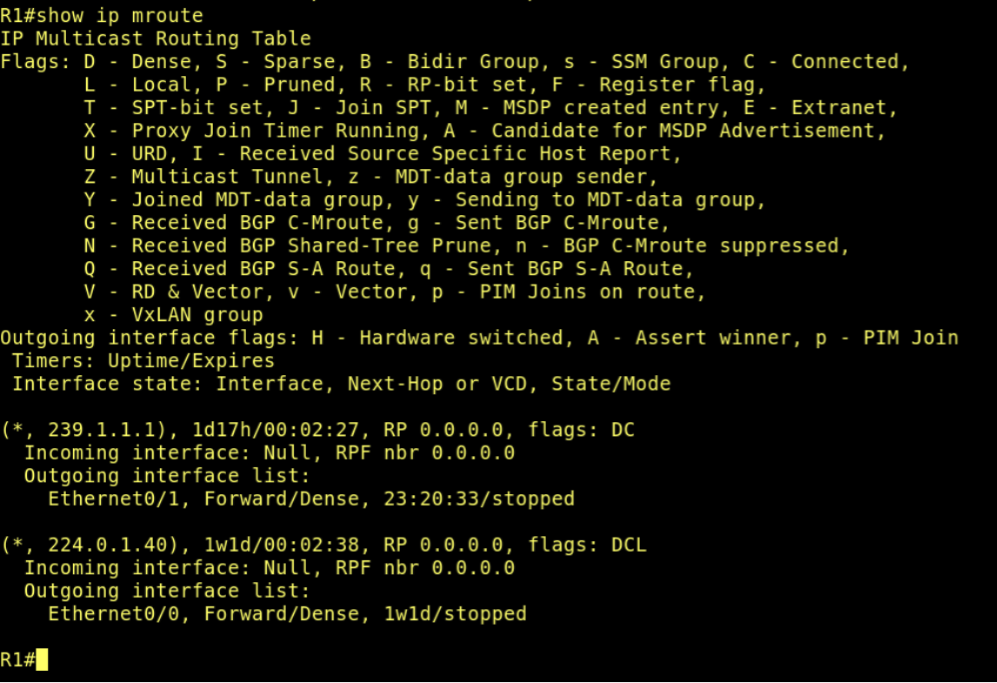

*Figura 13: show ip mroute no R1.*

## 14. Entrega

Conforme especificado no enunciado do laboratório, os itens a entregar e o status atual de cada um são:

- Captura de tela da topologia montada no PNetLab: concluído (Figuras 1 e 2).

- Configuração aplicada no roteador: concluído (endereçamento IP das interfaces e ativação do PIM-DM, seções 3 e 4).

- Saída dos comandos show ip pim interface e show ip mroute: concluído (Figura 4 e evidência adicional de show ip mroute confirmando a entrada (\*, 239.1.1.1) com saída pela Ethernet0/1 em modo Forward/Dense).

- Evidência do envio do tráfego multicast: concluído (Figura 10, Host Origem enviando datagramas UDP para o grupo 239.1.1.1 com TTL 32).

- Evidência da recepção do tráfego multicast: pendente. O Host Receptor se associa ao grupo (IGMP Join) e o R1 registra o interesse do receptor, mas ainda não foi confirmado que o tráfego de dados enviado pelo Host Origem chega até o Host Receptor. Investigação em andamento nos switches SW1/SW2 (IGMP snooping) e nos contadores de interface do R1.
