# Laboratório 04 — RIPv2 e Análise de Convergência

> Disciplina: ENE0025 - Protocolos de Transporte e Roteamento (UnB) · Prof. Dr. Laerte Peotta de Melo
> Roteiro de referência: [peotta/PTR](https://github.com/peotta/PTR)
> [⬅ Voltar ao README](../README.md) · [Notas de aula — RIP e roteamento dinâmico](notas-aula-rip.md)

---

**Relatório — Laboratório 04**

RIPv2 e Análise de Convergência

**Disciplina:** ENE0025 - Protocolos de Transporte e Roteamento

**Professor responsável:** Prof. Dr. Laerte Peotta de Melo

**Aluno:** Lucas de Souza Viegas

**Instituição:** Universidade de Brasília (UnB)

## 1. Tema

Implementação do RIPv2 em uma topologia com três roteadores, seguida da análise de convergência da rede após a falha proposital de um enlace.

## 2. Topologia montada

A topologia foi montada no PNetLab conforme o roteiro do laboratório: dois hosts (VPC1 e VPC2) conectados a roteadores de borda (R1 e R3), interligados por um roteador intermediário (R2). As interfaces reais utilizadas foram e0/0 e e0/1 (em vez de g0/0 e g0/1, referência do roteiro), devido à IOL utilizada no PNetLab.

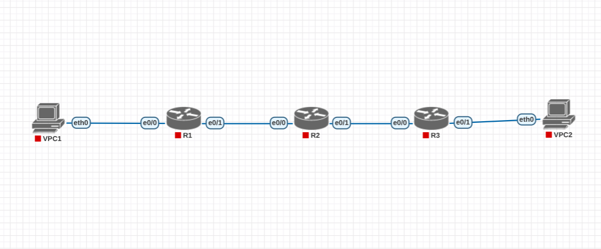

*Figura 1 — Topologia montada no PNetLab (VPC1–R1–R2–R3–VPC2).*

## 3. Endereçamento IP

|                 |               |                 |                 |
|-----------------|---------------|-----------------|-----------------|
| **Dispositivo** | **Interface** | **Endereço IP** | **Máscara**     |
| R1              | e0/0          | 192.168.10.1    | 255.255.255.0   |
| R1              | e0/1          | 10.0.12.1       | 255.255.255.252 |
| R2              | e0/0          | 10.0.12.2       | 255.255.255.252 |
| R2              | e0/1          | 10.0.23.1       | 255.255.255.252 |
| R3              | e0/0          | 10.0.23.2       | 255.255.255.252 |
| R3              | e0/1          | 192.168.30.1    | 255.255.255.0   |
| VPC1            | \-            | 192.168.10.10   | gw 192.168.10.1 |
| VPC2            | \-            | 192.168.30.10   | gw 192.168.30.1 |

## 4. Configuração dos roteadores

As configurações abaixo foram aplicadas nos três roteadores, habilitando RIPv2 sem sumarização automática (no auto-summary), com anúncio das redes diretamente conectadas.

### 4.1 R1

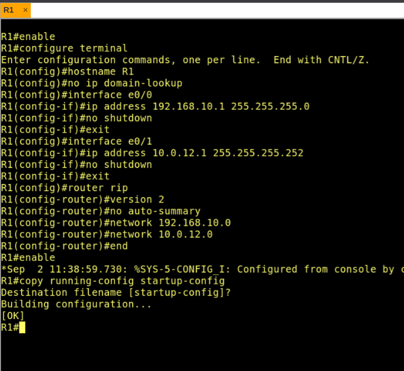

*Figura 2 — Configuração completa de R1, com aplicação de RIPv2 e salvamento (copy running-config startup-config).*

### 4.2 R2

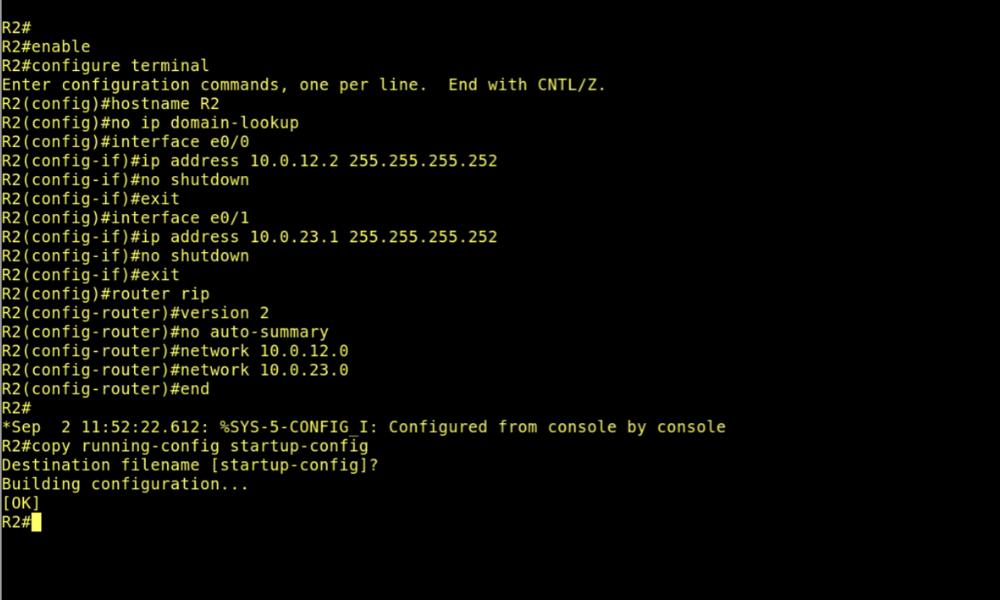

*Figura 3 — Configuração completa de R2.*

### 4.3 R3

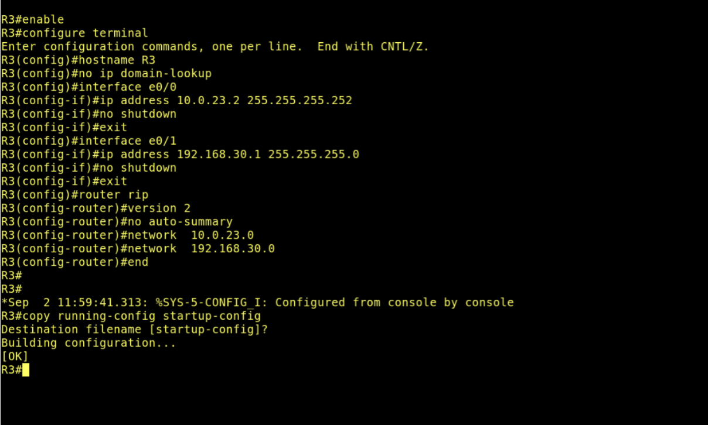

*Figura 4 — Configuração completa de R3.*

## 5. Verificação inicial — estado estável

Antes da simulação da falha, foi verificado o estado de interfaces, tabelas de roteamento e parâmetros do RIP em cada roteador, além da conectividade fim a fim entre VPC1 e VPC2.

### 5.1 R1

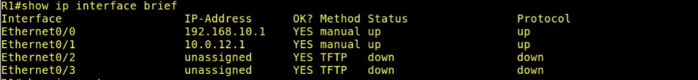

*Figura 5 — show ip interface brief em R1: interfaces e0/0 e e0/1 up/up.*

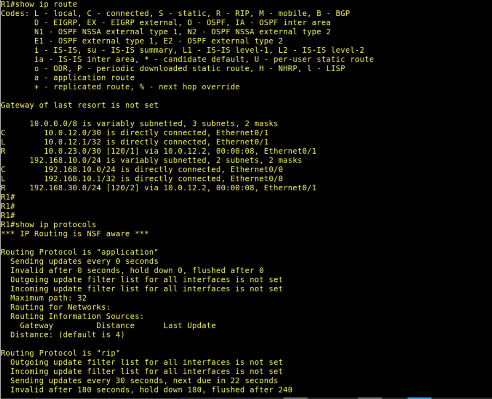

*Figura 6 — show ip route e show ip protocols em R1: rota para 192.168.30.0/24 aprendida via RIP, métrica \[120/2\].*

### 5.2 R2

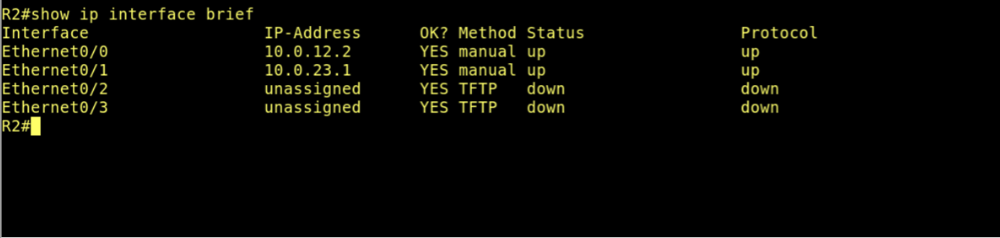

*Figura 7 — show ip interface brief em R2: interfaces e0/0 e e0/1 up/up.*

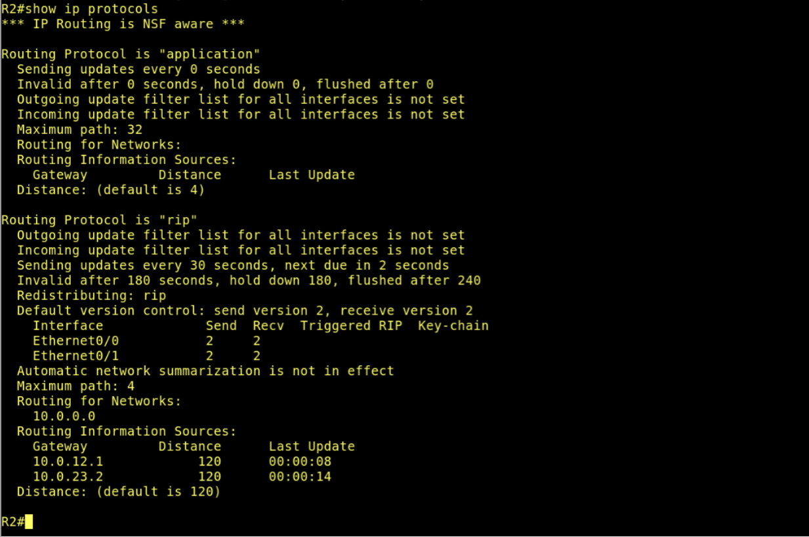

*Figura 8 — show ip protocols em R2: RIPv2 ativo, fontes de roteamento 10.0.12.1 e 10.0.23.2.*

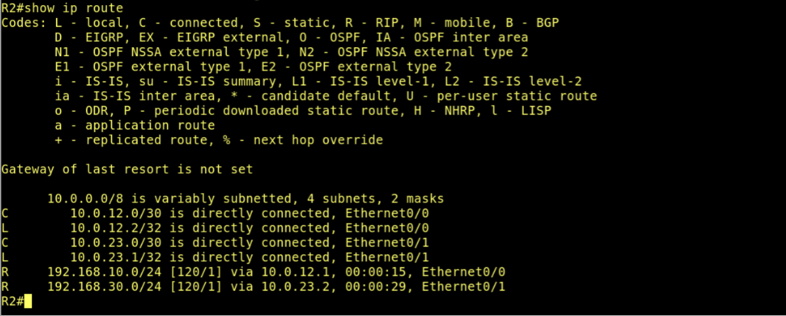

*Figura 9 — show ip route em R2: ambas as LANs (192.168.10.0/24 e 192.168.30.0/24) aprendidas via RIP, métrica \[120/1\].*

### 5.3 R3

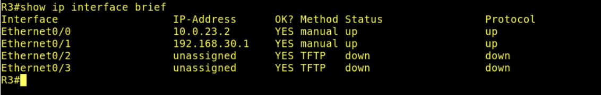

*Figura 10 — show ip interface brief em R3: interfaces e0/0 e e0/1 up/up.*

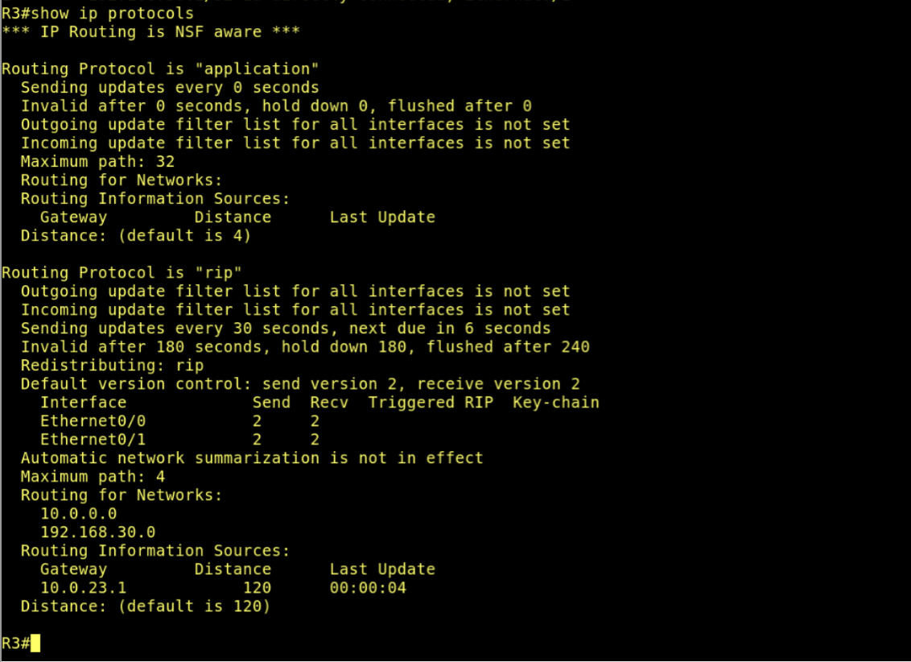

*Figura 11 — show ip protocols em R3: RIPv2 ativo.*

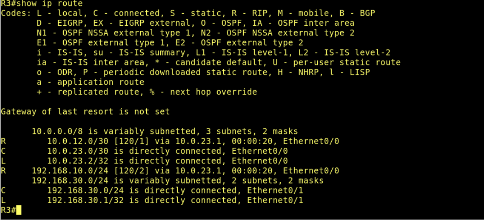

*Figura 12 — show ip route em R3: rota para 192.168.10.0/24 aprendida via RIP, métrica \[120/2\].*

### 5.4 Conectividade fim a fim

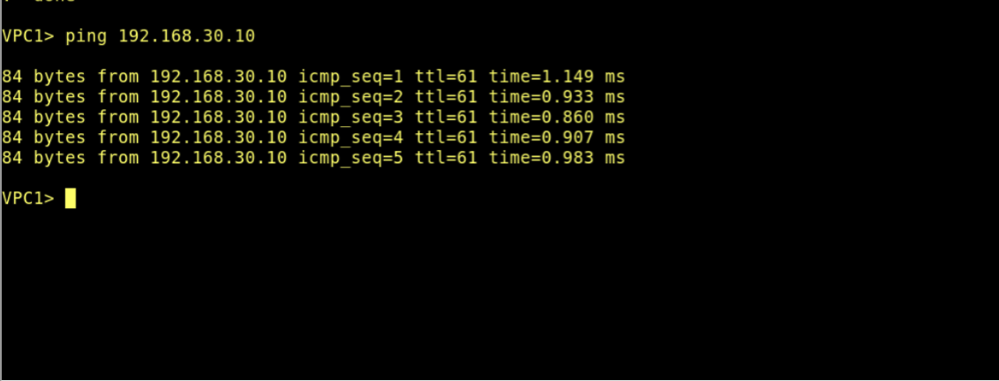

*Figura 13 — Ping de VPC1 (192.168.10.10) para VPC2 (192.168.30.10): 5/5 pacotes, 0% de perda, latência ~1ms.*

Conclusão da etapa: a rede convergiu corretamente antes da falha, com todas as rotas RIP visíveis e coerentes, e comunicação fim a fim funcionando plenamente.

## 6. Experimento de convergência

### 6.1 Falha do enlace R2–R3

Conforme o roteiro, a interface e0/1 de R2 (enlace com R3) foi desativada via shutdown, simulando a queda do link.

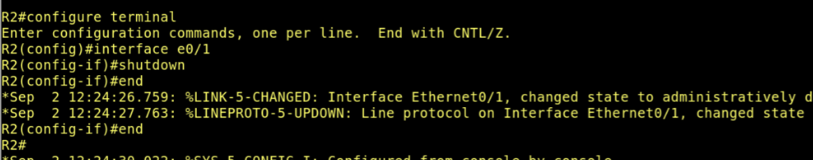

*Figura 14 — Shutdown da interface e0/1 em R2, às 12:24:26 (horário do log do roteador).*

### 6.2 Reação imediata (R1 e R2)

Logo após a falha, R1 e R2 — ambos diretamente conectados ao ponto de falha — já refletiam a mudança em suas tabelas de roteamento.

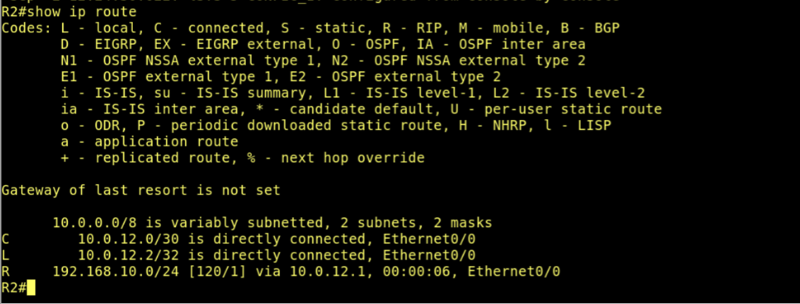

*Figura 15 — show ip route em R2 após a falha: a rede 10.0.23.0/30 (conectada) e a rota para 192.168.30.0/24 já não aparecem mais.*

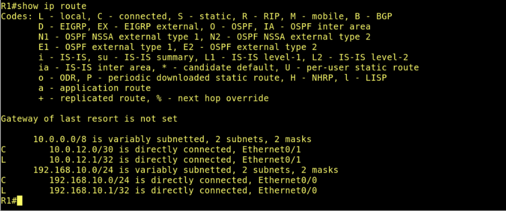

*Figura 16 — show ip route em R1 após a falha: a rota para 192.168.30.0/24 já desapareceu da tabela.*

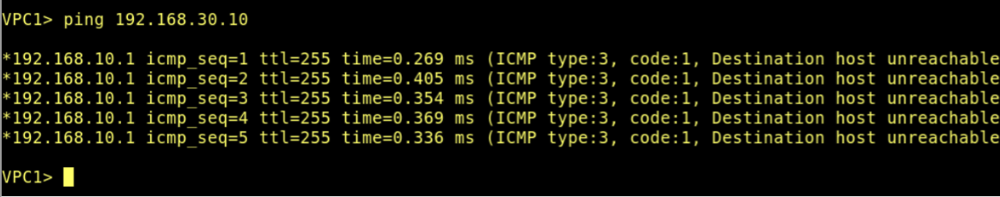

*Figura 17 — Ping de VPC1 para VPC2 logo após a falha: retorno de ICMP tipo 3 código 1 (Destination host unreachable), enviado pelo próprio R1 (192.168.10.1).*

### 6.3 Assimetria de convergência (R3)

Diferente de R1 e R2, o roteador R3 — situado do outro lado do enlace derrubado — não recebeu nenhum triggered update imediato e permaneceu, por um período, com rotas desatualizadas (stale) apontando ainda para o link inativo via R2.

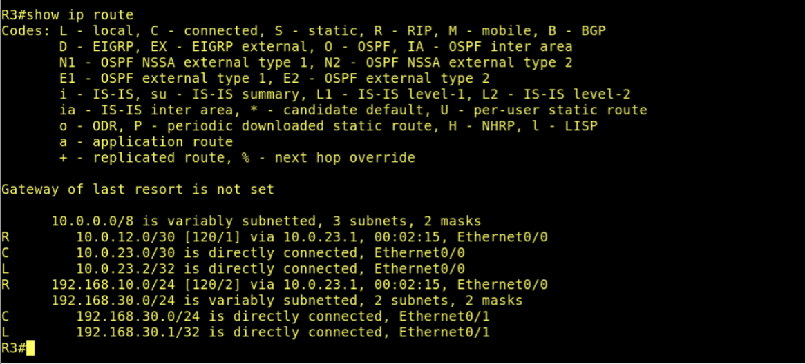

*Figura 18 — show ip route em R3 logo após a falha: rotas para 10.0.12.0/30 e 192.168.10.0/24 ainda presentes, com "idade" de 00:02:15, e 10.0.23.0/30 ainda listada como diretamente conectada.*

Esse comportamento evidencia, na prática, a lentidão característica do RIP: enquanto o lado onde a falha ocorreu fisicamente reage de forma quase instantânea (detecção de link down), o lado oposto do enlace depende dos temporizadores do protocolo (invalid after 180s, flushed after 240s) ou da chegada de um novo ciclo de atualização periódica (a cada 30s) para perceber a mudança.

### 6.4 Convergência final

Repetindo a verificação em R3 após aguardar os temporizadores do RIP, observou-se que a rede atingiu novo estado estável, com a remoção completa das rotas relacionadas ao enlace inativo.

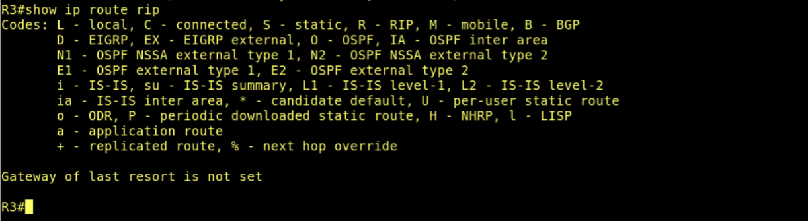

*Figura 19 — show ip route rip em R3: tabela de rotas RIP vazia, confirmando que as rotas obsoletas foram removidas.*

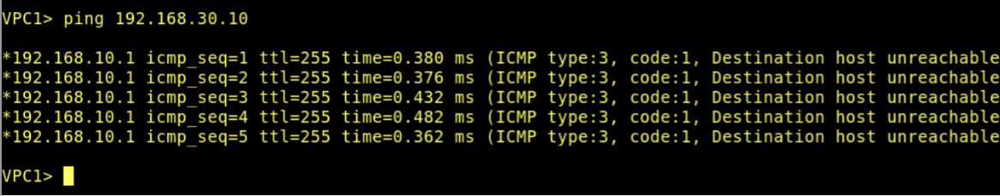

*Figura 20 — Ping de VPC1 para VPC2 após a convergência completa: continua retornando "Destination host unreachable", já que não há caminho redundante nesta topologia.*

## 7. Análise do tempo de convergência

A falha foi registrada às 12:24:26 (log de R2). R1 e R2 refletiram a mudança de forma praticamente imediata (poucos segundos), por estarem diretamente conectados ao ponto de falha. Já R3 manteve rotas obsoletas por um intervalo mais longo — a evidência coletada mostra a tabela ainda desatualizada (idade de 00:02:15) em um momento intermediário, e completamente limpa (show ip route rip vazio) em uma verificação posterior.

Não foi possível capturar o instante exato da transição em R3 (métrica 16 ou remoção da rota), portanto o tempo total de convergência nesse ponto é estimado com base no intervalo entre as duas capturas e no comportamento teórico dos temporizadores do RIP (invalid timer de 180s e flush timer de 240s a partir da última atualização recebida de R2 antes da falha). Isso é consistente com a limitação conhecida do RIP: como não há keepalive de vizinhança fim a fim, um roteador que não está diretamente ligado ao ponto de falha só percebe a mudança quando os temporizadores da rota expiram ou quando chega uma atualização (periódica ou triggered) informando a perda do caminho.

## 8. Respostas às questões de análise

### 1. Qual foi o tempo aproximado de convergência após a falha do enlace?

Em R1 e R2 (lado onde a falha ocorreu), a convergência foi praticamente imediata, da ordem de segundos, pois a detecção foi feita por link down físico. Em R3, a convergência foi mais lenta, ficando limitada pelos temporizadores do RIP (até 180s para invalidar a rota e até 240s para removê-la definitivamente, contados a partir da última atualização válida recebida antes da falha).

### 2. Quais rotas deixaram de aparecer na tabela de roteamento após a interrupção?

Em R2: a rede diretamente conectada 10.0.23.0/30 e a rota aprendida via RIP para 192.168.30.0/24. Em R1: a rota para 192.168.30.0/24 (aprendida via R2). Em R3: as rotas para 10.0.12.0/30 e 192.168.10.0/24 (ambas aprendidas via R2), além da percepção de que 10.0.23.0/30 deixou de ser um enlace ativo.

### 3. O que aconteceu com o tráfego entre as redes 192.168.10.0/24 e 192.168.30.0/24 após a falha?

O tráfego foi interrompido por completo. Os pings de VPC1 para VPC2 passaram a retornar mensagens ICMP tipo 3 código 1 (Destination host unreachable), geradas pelo próprio R1, indicando que ele não possuía mais rota válida para a rede de destino. Como a topologia não possui caminho redundante, a comunicação permaneceu interrompida mesmo após a convergência completa da rede.

### 4. Como o RIP representa uma rota inalcançável?

O RIP utiliza a métrica 16 para representar uma rota inalcançável (infinito no contexto do protocolo, já que o limite prático de saltos é 15). Uma rota que atinge a métrica 16 é considerada inválida e, após o tempo de flush, é removida da tabela de roteamento.

### 5. Por que o RIP tende a convergir mais lentamente do que protocolos como o OSPF?

O RIP é um protocolo de vetor-distância que depende fortemente de temporizadores (atualizações periódicas a cada 30s, invalidação em 180s, flush em 240s) e da propagação salto a salto das informações de roteamento — cada roteador só conhece o que seus vizinhos diretos anunciam. O OSPF, por ser um protocolo de estado de enlace, mantém uma base de dados topológica completa da área e propaga mudanças por meio de inundação (flooding) quase imediata das LSAs, recalculando rotas com o algoritmo SPF assim que a mudança é recebida, o que resulta em convergência muito mais rápida.

### 6. Qual a importância dos mecanismos de split horizon, poison reverse e triggered updates?

O split horizon evita que uma rota aprendida por uma interface seja reanunciada de volta pela mesma interface, reduzindo loops de roteamento. O poison reverse complementa esse mecanismo marcando explicitamente como inalcançável (métrica 16) uma rota ao reenviá-la pela interface de origem, tornando o aviso de invalidação mais claro e rápido do que simplesmente omitir a rota. Os triggered updates permitem que um roteador envie uma atualização assim que percebe uma mudança na topologia, sem esperar pelo próximo ciclo periódico, acelerando a propagação de falhas — exatamente o comportamento observado em R1 e R2 neste laboratório, que reagiram muito mais rápido do que R3.

### 7. Em que tipo de cenário real o RIP deixaria de ser uma escolha adequada?

O RIP se torna inadequado em redes de médio a grande porte, com muitos roteadores e múltiplos caminhos, onde a limitação de 15 saltos torna algumas rotas inatingíveis e a convergência lenta pode gerar longos períodos de inconsistência ou looping (count to infinity) durante mudanças de topologia. Cenários que exigem alta disponibilidade, convergência rápida diante de falhas, suporte a topologias complexas ou engenharia de tráfego mais sofisticada (como grandes redes corporativas ou provedores de serviço) normalmente adotam protocolos de estado de enlace (OSPF, IS-IS) ou vetor de caminho (BGP), mais escaláveis e responsivos.

## 9. Conclusão

Este laboratório permitiu configurar o RIPv2 em uma topologia com três roteadores e observar, na prática, seu comportamento diante de uma falha de enlace. Ficou evidente a diferença entre a reação imediata dos roteadores diretamente ligados ao ponto de falha (R1 e R2) e a resposta mais lenta do roteador do lado oposto (R3), que dependeu dos temporizadores do protocolo para atualizar sua tabela. A atividade reforçou de forma concreta as limitações clássicas do RIP — convergência lenta e dependência de temporizadores — e evidenciou a importância de mecanismos como split horizon, poison reverse e triggered updates, estabelecendo uma base sólida para a comparação futura com protocolos de convergência mais rápida, como o OSPF.
